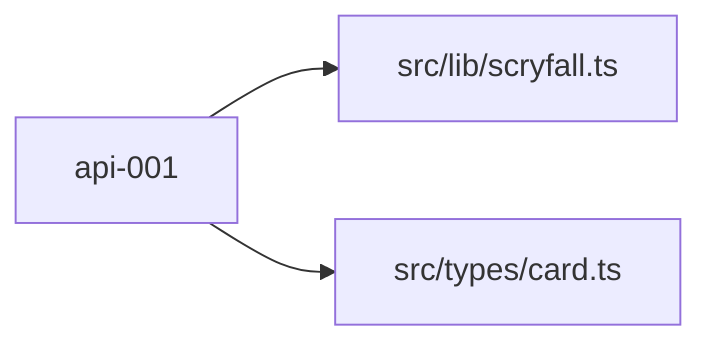

# api-001 — Scryfall API service — card lookup and deck validation

## Problem

The app needs to resolve card names from a pasted decklist into full card objects (image, mana cost, type, CMC, colors, price). Without this service the deck loader and the balancer have no data to work with.

## Scope

Build a typed Scryfall API client (`src/lib/scryfall.ts`) and a shared `Card` TypeScript type (`src/types/card.ts`). Expose two functions: `fetchCard(name)` and `fetchDeck(lines)`. **Nothing else.**

## What NOT to change

| Path | Reason |
|---|---|
| `src/app/` | UI is out of scope for this ticket |
| `src/store/` | Store shape is defined in data-001 |

## File checklist

| File | Action | Notes |
|---|---|---|
| `src/types/card.ts` | Create | Shared `ScryfallCard` and `DeckCard` types |
| `src/lib/scryfall.ts` | Create | `fetchCard`, `fetchDeck` functions |

## Implementation notes

### Types (`src/types/card.ts`)

```ts
export interface ScryfallCard {
  id: string
  name: string
  mana_cost: string
  cmc: number
  type_line: string
  colors: string[]
  color_identity: string[]
  image_uris?: { small: string; normal: string; large: string }
  card_faces?: Array<{ image_uris?: { small: string; normal: string; large: string } }>
  prices: { usd: string | null; eur: string | null; tix: string | null }
  legalities: Record<string, string>
}

export interface DeckCard {
  quantity: number
  card: ScryfallCard
}
```

### Scryfall client (`src/lib/scryfall.ts`)

```ts
const BASE = 'https://api.scryfall.com'

export async function fetchCard(name: string): Promise<ScryfallCard> {
  const res = await fetch(
    `${BASE}/cards/named?exact=${encodeURIComponent(name)}`,
    { next: { revalidate: 3600 } } // Next.js cache
  )
  if (!res.ok) throw new Error(`Card not found: ${name}`)
  return res.json() as Promise<ScryfallCard>
}

// lines: ["4 Lightning Bolt", "1 Sol Ring", ...]
export async function fetchDeck(lines: string[]): Promise<DeckCard[]> {
  const parsed = lines
    .map(l => l.trim())
    .filter(Boolean)
    .map(l => {
      const match = l.match(/^(\d+)\s+(.+)$/)
      return match ? { quantity: parseInt(match[1]), name: match[2] } : null
    })
    .filter(Boolean) as { quantity: number; name: string }[]

  const results = await Promise.allSettled(
    parsed.map(p => fetchCard(p.name).then(card => ({ quantity: p.quantity, card })))
  )

  return results
    .filter(r => r.status === 'fulfilled')
    .map(r => (r as PromiseFulfilledResult<DeckCard>).value)
}
```

### Notes

- Use `next: { revalidate: 3600 }` so Next.js caches card responses for 1 hour — avoids hammering Scryfall during dev.
- `fetchDeck` uses `Promise.allSettled` so one bad card name doesn't abort the whole deck. Failed cards are silently dropped; the UI can show missing cards separately (future ticket).
- Image resolution: prefer `image_uris.normal`. If absent (double-faced cards), use `card_faces[0].image_uris.normal`.

## Acceptance criteria

- [ ] `npm run build` completes with no TypeScript errors
- [ ] `fetchCard('Lightning Bolt')` resolves with a `ScryfallCard` object including `image_uris`
- [ ] `fetchDeck(['4 Lightning Bolt', '1 Sol Ring'])` resolves with 2 `DeckCard` objects
- [ ] Double-faced cards (e.g. "Delver of Secrets") do not throw — image falls back to `card_faces[0]`
- [ ] A completely invalid card name causes `fetchDeck` to return results without that card (no crash)


## Log

> [!success] Completed 2026-05-07 — attempt 2/2
> **Commit:** `bc356cf`
> **Files written:** [[src/lib/scryfall.ts]] · [[src/types/card.ts]]


