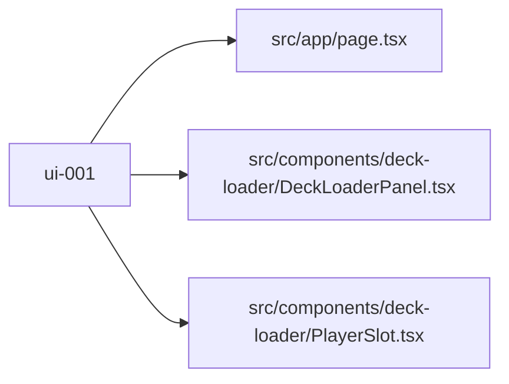

# ui-001 — Deck loader — player seat setup and decklist import

## Problem

There is no way for the user to enter players or paste decklists. The match cannot start without knowing who is playing and what deck each player is using.

## Scope

Build the deck loader panel: a grid of 2–4 player slot cards where each slot has a name input and a textarea for pasting a raw decklist (MTGO format: `4 Lightning Bolt`). A "Load Deck" button per slot triggers `useAppStore.loadDeck()`. Show a loading spinner while resolving and an error message on failure. **Nothing else.**

## What NOT to change

| Path | Reason |
|---|---|
| `src/lib/` | API layer is owned by api-001 |
| `src/store/` | Store is owned by data-001 |
| `src/components/table/` | Table view is owned by ui-002 |

## File checklist

| File | Action | Notes |
|---|---|---|
| `src/app/page.tsx` | Modify | Replace placeholder with `<DeckLoaderPanel />` + a "Start Match" button |
| `src/components/deck-loader/DeckLoaderPanel.tsx` | Create | Grid container, renders 2–4 `<PlayerSlot>` |
| `src/components/deck-loader/PlayerSlot.tsx` | Create | Name input, textarea, Load Deck button, status |

## Implementation notes

### Page layout (`src/app/page.tsx`)

```tsx
import DeckLoaderPanel from '@/components/deck-loader/DeckLoaderPanel'

export default function Home() {
  return (
    <main className="min-h-screen bg-background p-8">
      <h1 className="text-3xl font-bold mb-8 text-center">MTG Deck Balancer</h1>
      <DeckLoaderPanel />
    </main>
  )
}
```

### DeckLoaderPanel

- Renders a 2-column grid (md:grid-cols-2) of `<PlayerSlot>` for seats 1–4.
- A "Start Match →" button at the bottom, disabled until at least 2 seats have `cards.length > 0`.
- On click, router.push('/match') — route created in ui-002.

```tsx
'use client'
import { useAppStore } from '@/store'
import PlayerSlot from './PlayerSlot'
import { Button } from '@/components/ui/button'
import { useRouter } from 'next/navigation'

const SEATS = [1, 2, 3, 4] as const

export default function DeckLoaderPanel() {
  const players = useAppStore(s => s.players)
  const router = useRouter()
  const readyCount = players.filter(p => p.cards.length > 0).length

  return (
    <div className="space-y-6">
      <div className="grid grid-cols-1 md:grid-cols-2 gap-4">
        {SEATS.map(seat => <PlayerSlot key={seat} seat={seat} />)}
      </div>
      <div className="flex justify-center">
        <Button
          size="lg"
          disabled={readyCount < 2}
          onClick={() => router.push('/match')}
        >
          Start Match →
        </Button>
      </div>
    </div>
  )
}
```

### PlayerSlot

- Uses Shadcn `Card`, `Input`, `Textarea`, `Button`.
- Calls `addPlayer` on name blur (or when "Load Deck" is clicked if no player exists yet).
- Shows a `Loader2` spinner (lucide-react) while `player.loading`.
- Shows a `Badge` with card count once loaded (e.g. "60 cards").

```tsx
'use client'
import { useState } from 'react'
import { useAppStore } from '@/store'
import { Card, CardContent, CardHeader, CardTitle } from '@/components/ui/card'
import { Input } from '@/components/ui/input'
import { Textarea } from '@/components/ui/textarea'
import { Button } from '@/components/ui/button'
import { Badge } from '@/components/ui/badge'
import { Loader2 } from 'lucide-react'
import type { PlayerSeat } from '@/types/deck'

export default function PlayerSlot({ seat }: { seat: PlayerSeat }) {
  const [name, setName] = useState(`Player ${seat}`)
  const [raw, setRaw] = useState('')
  const addPlayer = useAppStore(s => s.addPlayer)
  const loadDeck = useAppStore(s => s.loadDeck)
  const player = useAppStore(s => s.players.find(p => p.seat === seat))

  async function handleLoad() {
    addPlayer(seat, name)
    await loadDeck(seat, raw)
  }

  const totalCards = player?.cards.reduce((sum, dc) => sum + dc.quantity, 0) ?? 0

  return (
    <Card>
      <CardHeader>
        <CardTitle className="flex items-center gap-2">
          Seat {seat}
          {totalCards > 0 && <Badge variant="secondary">{totalCards} cards</Badge>}
        </CardTitle>
      </CardHeader>
      <CardContent className="space-y-3">
        <Input
          placeholder="Player name"
          value={name}
          onChange={e => setName(e.target.value)}
        />
        <Textarea
          placeholder={"4 Lightning Bolt\n20 Mountain\n..."}
          rows={8}
          value={raw}
          onChange={e => setRaw(e.target.value)}
          className="font-mono text-sm"
        />
        {player?.error && (
          <p className="text-destructive text-sm">{player.error}</p>
        )}
        <Button
          className="w-full"
          onClick={handleLoad}
          disabled={!raw.trim() || player?.loading}
        >
          {player?.loading ? <Loader2 className="animate-spin mr-2 h-4 w-4" /> : null}
          {player?.loading ? 'Loading…' : 'Load Deck'}
        </Button>
      </CardContent>
    </Card>
  )
}
```

### Required Shadcn components to install

```bash
npx shadcn@latest add card input textarea button badge
npm install lucide-react
```

## Acceptance criteria

- [ ] `npm run build` completes with no TypeScript errors
- [ ] All 4 player slot cards render on the home page
- [ ] Pasting a decklist and clicking "Load Deck" shows spinner then card count badge
- [ ] "Start Match →" button is disabled until 2+ decks are loaded
- [ ] Error message appears if a deck fails to load (e.g. all invalid card names)
- [ ] Each slot is independently functional (loading one deck does not affect others)


## Log

> [!success] Completed 2026-05-07 — attempt 1/2
> **Commit:** `616d650`
> **Files written:** [[src/app/page.tsx]] · [[src/components/deck-loader/DeckLoaderPanel.tsx]] · [[src/components/deck-loader/PlayerSlot.tsx]]




## Log

> [!danger] Blocked 2026-05-07 — failed 2/2 attempts
> **Error:** Auto-stash restore failed after finalize merge.
> **Next step:** Human review required

```
Auto-stash restore failed after finalize merge.
git stash apply stash@{0}
error: could not write index
The stash was kept as stash@{0}. Resolve the conflicts manually before re-running orchestrator.
```


## Log

> [!danger] Blocked 2026-05-07 — failed 2/2 attempts
> **Error:** Auto-stash restore failed after finalize merge.
> **Next step:** Human review required

```
Auto-stash restore failed after finalize merge.
git stash apply stash@{0}

The stash was kept as stash@{0}. Resolve the conflicts manually before re-running orchestrator.
```
