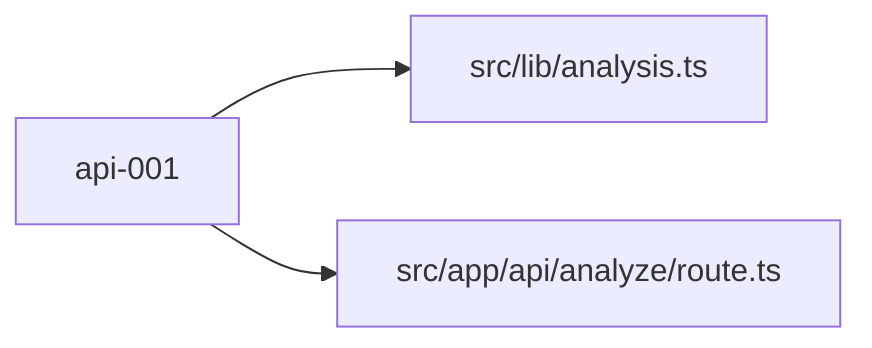

# api-001 — Extract Anthropic analysis logic into dedicated module

## Problem

`src/app/api/analyze/route.ts` currently mixes prompt construction, Anthropic SDK invocation, response text extraction, and JSON parsing into a single function. This makes the analysis logic untestable, hard to iterate on, and impossible to reuse. The architecture doc explicitly calls this out as technical debt to address in Phase 2.

## Scope

Create `src/lib/analysis.ts` with two exported functions: `buildAnalysisPrompt(players)` and `parseAnalysisResponse(text)`. Update `route.ts` to import and delegate to these functions, leaving the route as a thin orchestrator. The Anthropic client stays in (or moves to) `route.ts` — do not expose it through the new module. **Nothing else.**

## What NOT to change

| Path | Reason |
|---|---|
| `src/types/analysis.ts` | Types defined in data-001 — do not redefine |
| `src/lib/scryfall.ts` | Scryfall layer out of scope |
| `src/components/` | UI out of scope |
| `src/store/` | Store out of scope |

## File checklist

| File | Action | Notes |
|---|---|---|
| `src/lib/analysis.ts` | Create | `buildAnalysisPrompt` and `parseAnalysisResponse` functions |
| `src/app/api/analyze/route.ts` | Modify | Import from `src/lib/analysis`, remove inlined logic |

## Implementation notes

### Step 1 — Create `src/lib/analysis.ts`

This module is pure logic — no Anthropic SDK import, no Next.js imports.

```ts
import type { Player } from '@/types/deck'
import type { AnalysisReport } from '@/types/analysis'

export function buildAnalysisPrompt(players: Player[]): string {
  const sections = players
    .map(p => {
      const cardList = p.cards
        .map(dc => `${dc.quantity}x ${dc.card.name} (CMC ${dc.card.cmc}, ${dc.card.type_line})`)
        .join('\n')
      return `## ${p.name} (Seat ${p.seat})\n${cardList}`
    })
    .join('\n\n')

  return `You are an expert Magic: The Gathering judge analyzing deck balance for a casual multiplayer match.

${sections}

Analyze these decks and respond with ONLY valid JSON in this exact shape:
{
  "scores": [
    { "seat": 1, "name": "Player1", "score": 75, "summary": "One-sentence verdict" }
  ],
  "explanation": "2-4 paragraphs of markdown explaining the power differential, key cards driving imbalance, and suggestions for fair play"
}

Scores are integers 0-100. Higher = stronger deck. Be concise and fair.`
}

export function parseAnalysisResponse(text: string): AnalysisReport {
  // Strip markdown code fences if the model wraps JSON in them
  const jsonMatch = text.match(/\{[\s\S]*\}/)
  if (!jsonMatch) {
    throw new Error('No JSON object found in analysis response')
  }
  const parsed = JSON.parse(jsonMatch[0]) as AnalysisReport
  if (!Array.isArray(parsed.scores) || typeof parsed.explanation !== 'string') {
    throw new Error('Analysis response does not match expected AnalysisReport shape')
  }
  return parsed
}
```

### Step 2 — Update `src/app/api/analyze/route.ts`

Replace the inlined `buildPrompt` and JSON parsing with imports from `src/lib/analysis`:

```ts
import Anthropic from '@anthropic-ai/sdk'
import { NextResponse } from 'next/server'
import type { Player } from '@/types/deck'
import { buildAnalysisPrompt, parseAnalysisResponse } from '@/lib/analysis'

const client = new Anthropic({ apiKey: process.env.ANTHROPIC_API_KEY })

export async function POST(req: Request) {
  try {
    const { players } = (await req.json()) as { players: Player[] }

    if (!players || players.length < 2) {
      return NextResponse.json({ error: 'Need at least 2 players' }, { status: 400 })
    }

    const message = await client.messages.create({
      model: 'claude-3-5-sonnet-20241022',
      max_tokens: 1024,
      messages: [{ role: 'user', content: buildAnalysisPrompt(players) }],
    })

    const content = message.content[0]
    if (content.type !== 'text') {
      throw new Error('Unexpected response type from Claude')
    }

    const report = parseAnalysisResponse(content.text)
    return NextResponse.json(report)
  } catch (error) {
    console.error('Analysis error:', error)
    return NextResponse.json(
      { error: error instanceof Error ? error.message : 'Internal Server Error' },
      { status: 500 }
    )
  }
}
```

Delete the old `buildPrompt` function and the inline JSON parsing from `route.ts` — those now live in `src/lib/analysis.ts`.

## Acceptance criteria

- [ ] `pnpm build` completes with no TypeScript errors
- [ ] `src/lib/analysis.ts` exists and exports `buildAnalysisPrompt` and `parseAnalysisResponse`
- [ ] `route.ts` no longer contains `buildPrompt` or any inline `JSON.parse` of the Anthropic response
- [ ] `parseAnalysisResponse` throws a descriptive error when text contains no JSON object
- [ ] `parseAnalysisResponse` throws a descriptive error when the parsed JSON does not have `scores` array and `explanation` string
- [ ] Analyzing a deck from the browser still returns a valid report


## Log

> [!success] Completed 2026-05-07 — attempt 2/2
> **Commit:** `c9d4cc7`
> **Files written:** [[src/lib/analysis.ts]] · [[src/app/api/analyze/route.ts]]


